# AS-Portfolio 
###### *Updated June 2021*

## Description

Updated portfolio page now includes images and links for latest homework projects: Third Triad Mojo Tech Blog, Note Taker App, and Password Generator in addition to the previous homework projects: Coding Quiz Challenge, Weather Dashboard App, and Work Day Scheduler. The featured work panel for major Projects now features Project 1:  News Flash App and Project 2: Tick Tock Birthday Clock. The Resume link now downloads an updated resume as well.

Utilizes the following technologies:
  * HTML
  * JavaScript
  * CSS
---

## Table of Contents 

[Usage](#usage) 

[License](#license) 

[Contributors](#contributors) 

[Tests](#tests) 

[Questions](#Questions) 

---

## Usage

My files can be accessed in the repository [HERE](https://github.com/arcangyl1963/AS-Portfolio) 

The image below shows the repository where my project files are located: 

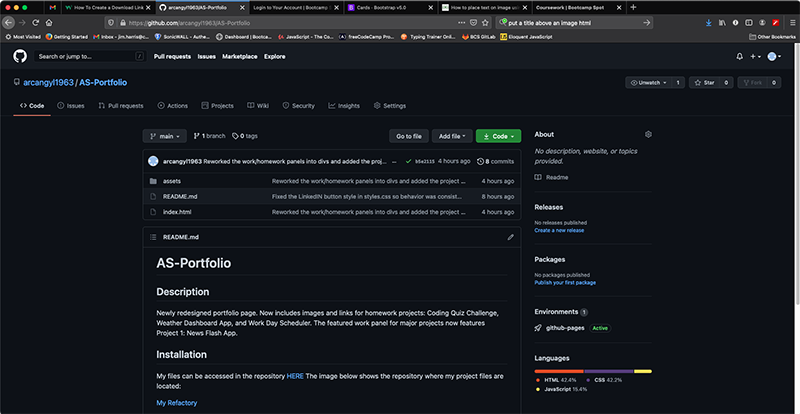 

The web application can be viewed [HERE](https://arcangyl1963.github.io/AS-Portfolio/). 

The images below show the updated portfolio page design and highlights to some of the new features that have been added: 

The main page shows the redesigned layout featuring an updated theme and background image. The work project sections are displayed by default while the About bio section is hidden. 

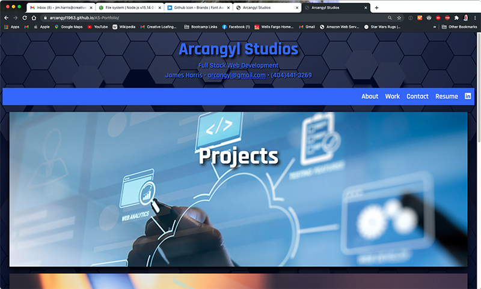 

Clicking the About button in the navbar while hide the work project sections and reveal the About bio content. Note the About nav button color changes when it is the active selection. 

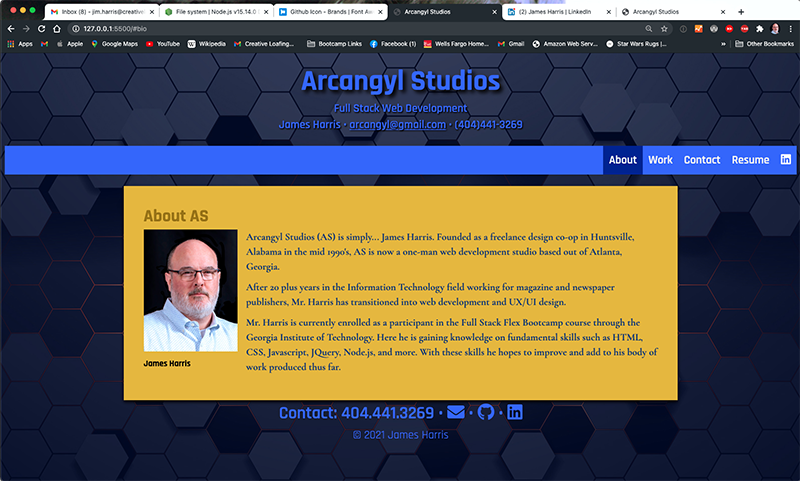 

Hovering the cursor over the navbar buttons will also change the color theme of the button contents. 

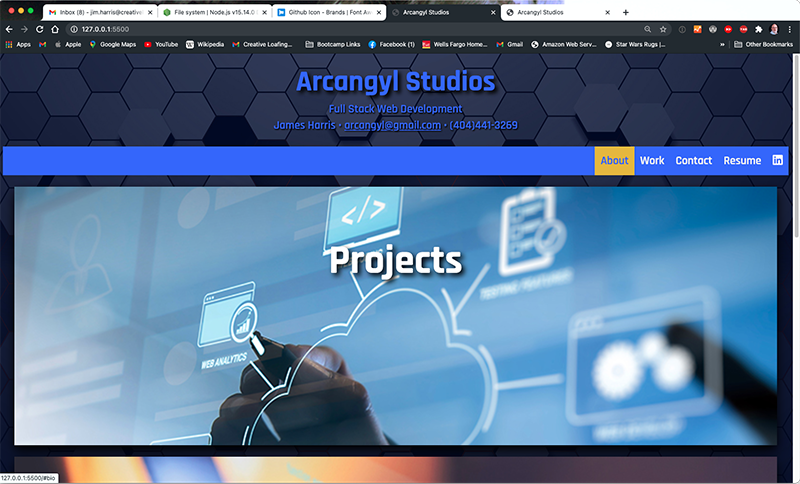 

Clicking another navbar button will return the previously active button to the inactive theme state and the clicked button will display as active. Clicking the Work button reveals the work projects section and hides the About Bio section content. 

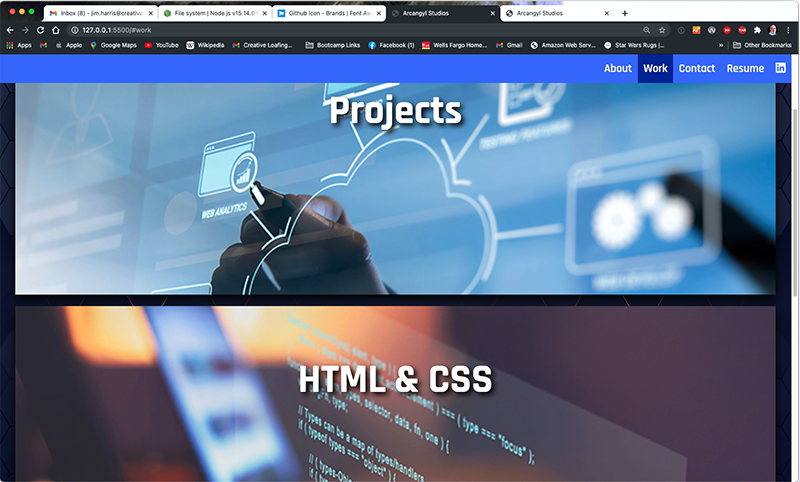 

Clicking the Contact button auto-scrolls to display the Contact info located in the footer. Note the sticky-behavior of the navbar while scrolling the page. 

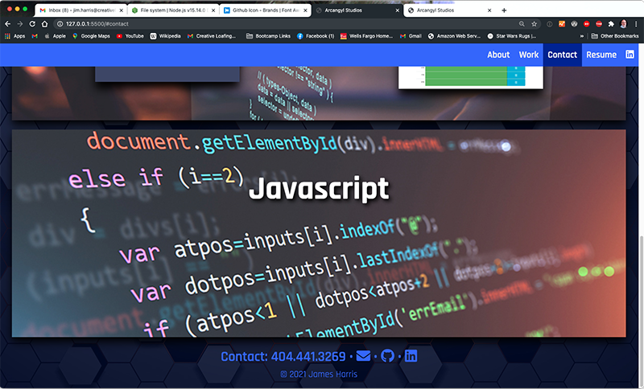 

When you mouse-over the icon links for my email, my GitHub repositories, and LinkedIN profile, the icons change color. 

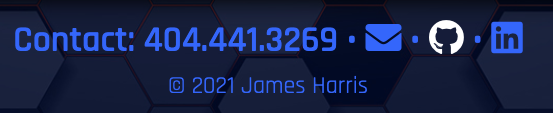 

Clicking the Resume button opens a PDF version of my updated resume in a new tab. The PDF can be viewed, printed, or downloaded using the built-in PDF viewer capabilities of most modern browsers. 

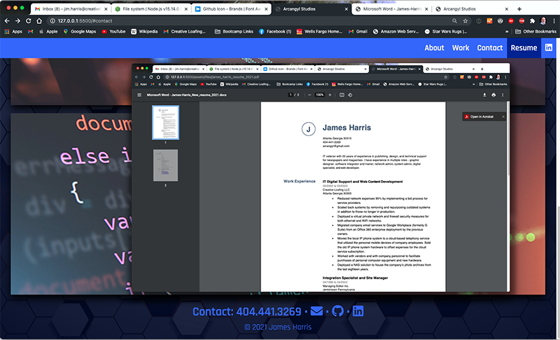 

Click the Work navbar button to reveal the projects section. There are three sections - Projects (for the three major projects), HTML & CSS, and Javascript & MySQL. 

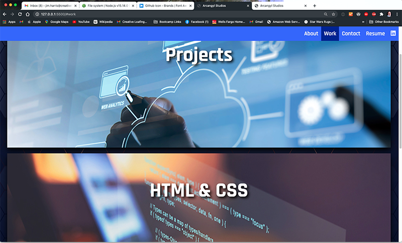 

Clicking on the section heading; i.e. "Projects", will reveal the project panels associated with each section. There is room to add additional panels for future projects and assigments. Our Project 1 panel is featured in the Projects section. 

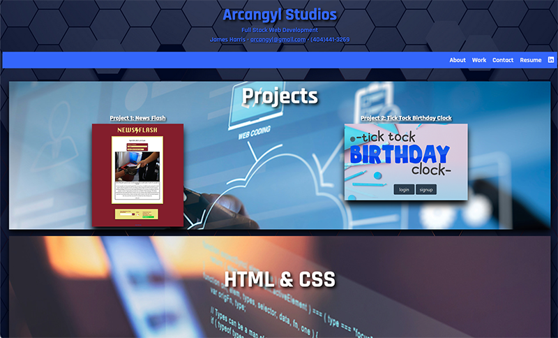 

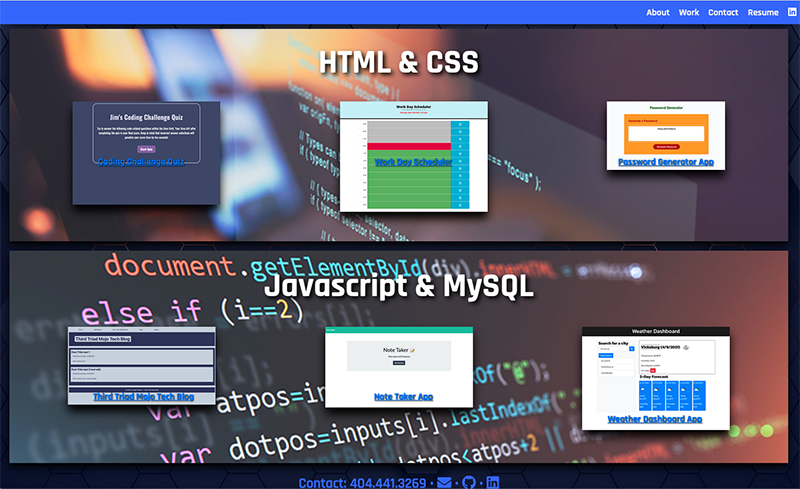 

Clicking on the project's image will open the application's published page from GitHub in new tab or window. Clicking on the project title will open the GitHub repository for the project. 

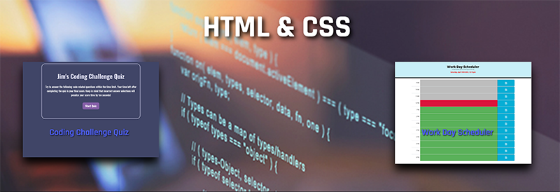 

## License: 

 This software is licensed under an MIT license:  Copyright © 2021 Arcangyl Studios  Permission is hereby granted, free of charge, to any person obtaining a copy of this software and associated documentation files (the 'Software'), to deal in the Software without restriction, including without limitation the rights to use, copy, modify, merge, publish, distribute, sublicense, and/or sell copies of the Software, and to permit persons to whom the Software is furnished to do so, subject to the following conditions: The above copyright notice and this permission notice shall be included in all copies or substantial portions of the Software. THE SOFTWARE IS PROVIDED 'AS IS', WITHOUT WARRANTY OF ANY KIND, EXPRESS OR IMPLIED, INCLUDING BUT NOT LIMITED TO THE WARRANTIES OF MERCHANTABILITY, FITNESS FOR A PARTICULAR PURPOSE AND NONINFRINGEMENT. IN NO EVENT SHALL THE AUTHORS OR COPYRIGHT HOLDERS BE LIABLE FOR ANY CLAIM, DAMAGES OR OTHER LIABILITY, WHETHER IN AN ACTION OF CONTRACT, TORT OR OTHERWISE, ARISING FROM, OUT OF OR IN CONNECTION WITH THE SOFTWARE OR THE USE OR OTHER DEALINGS IN THE SOFTWARE. 

---

## Contributors: 

James Harris 

---

## Tests: 

There were no test scripts created for this application. 

---

## Questions: 

- Feel free to email me with any questions about this project at: arcangyl@gmail.com 

 

- My GitHub profile may be viewed by clicking [here](https://github.com/arcangyl1963).

© 2021 arcangyl studios